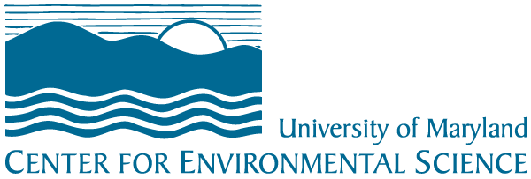
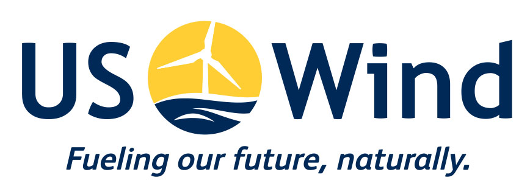
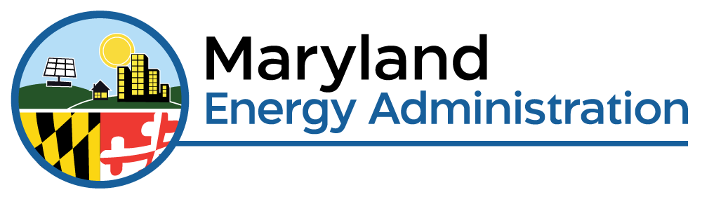
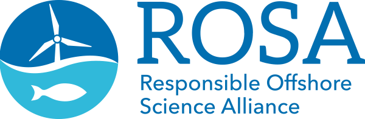
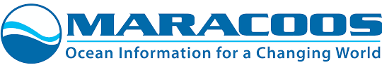
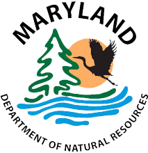
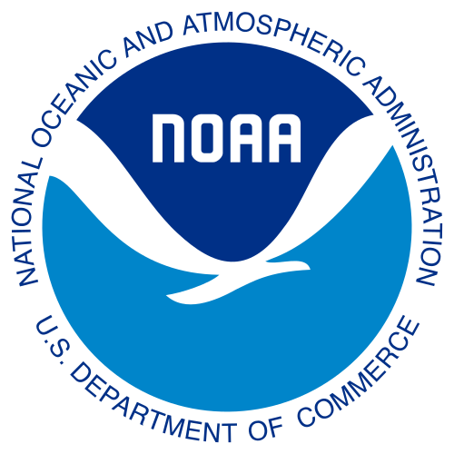

---
format:
    html: 
      footnotes-hover: true
resources: 
  - video/RTWB_crop.mp4
  - index_images/TailWinds_logo.png
---
::: {.column-screen}

  <video autoplay muted loop playsinline class="hero-video">
    <source src="video/RTWB_crop.mp4" type="video/mp4">
  </video>
  
  

:::

<!-- Give a little more space before text starts -->
 

**University of Maryland Center for Environmental Science (UMCES) TAILWINDS** is a coordinated program of assessment through ocean observing ecosystems, fisheries, and animal migrations that may be impacted by human activities in the U.S. Mid-Atlantic Bight. A portfolio of industry, state, NGO, and federal grants and assets are supporting:

1. Ocean observing system data synthesis, development of soundscape assessments, and quantitative models of cetacean and migratory fish distributions in offshore wind project areas;
2. Near-real time surveillance and dynamic ocean management of baleen whales through a satellite-linked ocean listening buoy; 
3. Long-term research and monitoring of commercial and recreational fishery fleets and their adaptation to offshore wind energy development;
4. Long-term research and monitoring of the distribution and ecology of marine mammals and migratory fishes as they are affected by offshore wind energy development, shipping noise, and ocean conditions.

**TAILWINDS** assets include:

1. A team of trained and experienced specialists in fisheries, cetacean ecology, bioacoustics, data science, and field operations.
2. Mid-Atlantic Bight shelf array of passive acoustic and telemetry assets in support of integrated soundscape, oceanographic, and biodiversity measures. Specializes assets designed to detect, localize and record behaviors and migrations of cetaceans and electronically-tagged sharks, fishes and turtles.
3. Autonomous buoy ([Ocean City buoy](https://dcs.whoi.edu/mdoc2505/mdoc2505_mdoc.shtml)) for sub-hour detection and analyst identification of endangered North Atlantic right whales and other baleen species (2021-present).

{width=350}
{width=350}
{width=350}
{width=350}
{width=350}
{width=173}
{width=173}